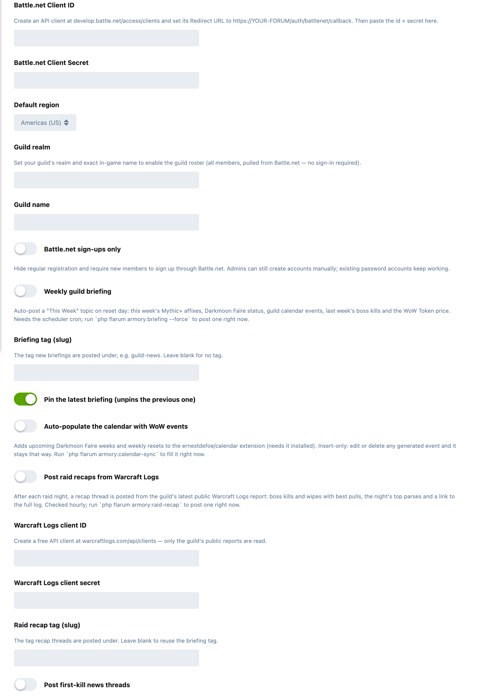

# Armory

A World of Warcraft armory for Flarum 2. Members sign in with Battle.net, and
their characters come straight from the Blizzard API onto a tabbed character
page, beside their posts, and into your guild's roster.

## What it does

- **Battle.net sign-in.** One click connects an account and its characters sync automatically. Optionally make Battle.net the only way to sign up.
- **A character page** at `/armory`, with tabs for:
  - **Gear:** every slot beside a 3D character render, with Wowhead-style item tooltips (item level, stats, sockets, set bonuses, sell price).
  - **Stats:** primary and secondary stats, defences and resources.
  - **Talents:** active spec, talents and the in-game loadout import string.
  - **PvE:** Mythic+ rating and best runs, raid progress, and what each character has done towards this week's Great Vault.
  - **Professions,** **PvP** (honour level and rated 2v2, 3v3 and RBG), **reputations** and **achievements and collections**.
- **Look up anyone.** Search any character by region, realm and name, linked or not.
- **Your roster.** Switch between your characters, hide alts, and choose a primary character. New members are nudged to pick one.
- **Characters beside posts.** Each author's primary character shows in a pane beside their posts, and their character portrait, in a class-coloured frame, replaces their avatar in the discussion list.
- **Link an item.** A composer button searches WoW items by name and links one, with its tooltip.
- **Guild page** at `/guild`: every member of your guild pulled from Battle.net (no sign-in needed), any of them inspectable, plus a Mythic+ leaderboard with the week's biggest climber and raid progression.
- **Crafting directory** at `/crafting`: who in the guild can craft what, searchable by recipe, built from every linked character's professions.
- **Widgets:** the WoW Token price, and a Now Recruiting box listing the classes you are recruiting with a note for each.
- **Automatic guild posts,** each off until you turn it on:
  - **Weekly briefing** on reset day: Mythic+ affixes, Darkmoon Faire, guild calendar events, last week's boss kills and the WoW Token price. Optionally pinned, unpinning the previous one.
  - **Raid recaps** from the guild's public Warcraft Logs reports: kills, wipes with best pulls, top parses and a link to the log.
  - **First-kill threads** when a boss falls for the first time on a difficulty.
  - **Hotfixes and patch notes** from the Wowhead news feed.
  - **Boss strategy hubs:** one scaffolded thread per boss of the guild's current raid.
- **Calendar events.** With [ernestdefoe/calendar](https://github.com/ernestdefoe/calendar), upcoming Darkmoon Faire weeks and weekly resets are added for you.
- **Role-Play and Arena tie-ins.** With [ernestdefoe/roleplay](https://github.com/ernestdefoe/roleplay) installed, **Add to Role-Play** imports a WoW character as a playable character: a combat sheet scaled from item level and primary stats, and a deck of class ability cards. With forumaker/arena installed, a character can be imported into Arena the same way. Re-run after a gear upgrade to rescale.

## Settings

Admin → Armory:



- **Battle.net Client ID and Secret,** and the **default region** (Americas, Europe, Korea or Taiwan).
- **Guild realm and name:** your guild's exact in-game name, which turns on the guild roster, leaderboard and guild posts.
- **Battle.net sign-ups only:** hides regular registration. Admins can still create accounts by hand, and existing password accounts keep working.
- **Now recruiting:** tick the classes you're recruiting, with an optional note for each.
- **Weekly briefing, raid recaps, first-kill news, patch notes and strategy hubs:** each a switch, each with the tag its threads are posted under. Raid recaps also need a free Warcraft Logs API client.
- **Calendar events:** a switch.

## Good to know

- **Members sign in once.** Public character data is fetched with an app-level token, so refreshes never ask the member to sign in again. Their own Battle.net token is used once, to find which characters are theirs.
- **Cached, and off the request path.** Character data is cached so pages stay fast and well under Blizzard's rate limits. The guild leaderboard and progression are built by the scheduler, never while a page waits.
- **Turning on a news feed doesn't flood the forum.** First-kill news and patch notes start from what is already out there and post only what comes after.
- **Automatic posts come from your first administrator.** Briefings, recaps, news, patch notes and strategy hubs are posted as the administrator with the lowest user id, never as a member. If the tag a feature is set to post under doesn't exist, or that account may not start discussions there, nothing is posted and the reason is written to the forum log; a recap that was skipped posts on the next run after you fix it.
- **The Great Vault figure for Mythic+ is a floor.** Blizzard reports one best run per dungeon each week, so repeat runs of the same dungeon count once. World and delve slots aren't shown, because Blizzard doesn't expose them.
- **Needs the scheduler.** Briefings, recaps, news, the leaderboard and calendar events run from `php flarum schedule:run`, which should run from cron every minute. Each has a command to run it by hand, given in its setting's help text.
- **Theme-aware.** Colours follow your forum's light and dark schemes.

## Installation

```bash
composer require ernestdefoe/armory
php flarum migrate
php flarum cache:clear
```

Then enable **Armory** in the admin panel and:

1. Create a Battle.net API client at [develop.battle.net/access/clients](https://develop.battle.net/access/clients), with its **Redirect URL** set to `https://YOUR-FORUM/auth/battlenet/callback`.
2. In **Admin → Armory**, paste the **Client ID** and **Client Secret** and choose your default region.
3. Members open **Armory** from the navigation and connect Battle.net.

## Updating

```bash
composer update ernestdefoe/armory
php flarum migrate
php flarum cache:clear
```

## Licence

[MIT](LICENSE) © ernestdefoe
